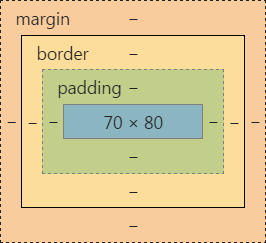
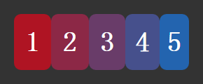
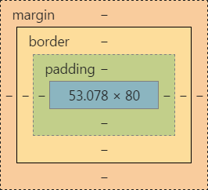

# Flexbox布局的正确使用姿势

## Flexbox兼容性


## Flexbox新旧属性

Flexbox的新属性提供了很多旧版本没有的功能，但是目前Android4.x和UC仍有一定市场占有率需要兼容，因此目前只使用新旧属性都有的功能。
能实现相同功能的Flexbox新旧属性如下表：


但想象是美好的，现实是残酷的，新旧属性里有那么几个顽固分子并不能乖乖的表现的一样，总有那么一点不同。
下面我们来看看是哪些新旧属性有不同：

#### `flex-direction:row-reverse` vs `box-orient:horizontal;box-direction:reverse`
相同点：改变主轴方向和伸缩项目的排列顺序；在ltr下伸缩项目从右到左排列。

不同点：

`flex-direction:row-reverse`：第一个伸缩项目向主轴起点对齐


`box-orient:horizontal;box-direction:reverse`：最后一个伸缩项目向主轴终点对齐


#### `flex-direction:column-reverse` vs `box-orient:vertical;box-direction:reverse`
相同点：改变主轴方向和伸缩项目的排列顺序；在ltr下伸缩项目从下到上排列。

不同点：

`flex-direction:column-reverse`：第一个伸缩项目向主轴起点对齐。


`box-orient:vertical;box-direction:reverse`：最后一个伸缩项目向主轴终点对齐。


#### `oreder:integer` vs `box-ordinal-group:integer`
相同点：定义伸缩项目显示顺序。

不同点：

`oreder:integer`：默认值为0；可以为负值。
`box-ordinal-group:integer`：默认值为1；取值大于1。

#### `flex-grow:number` vs `box-flex:number`
相同点：定义伸缩项目的扩展因素。

不同点：`box-flex:number`同时定义了伸缩项目的缩小因素。

#### `flex-shrink:number` vs `box-flex:number`
相同点：定义伸缩项目的缩小因素。

不同点：`box-flex:number`同时定义了伸缩项目的扩展因素。

## Flexbox分配空间原理
影响Flexbox布局分配空间的属性有三个，分别是`flex-grow`、`flex-shrink`和`flex-basis`。
* `flex-grow`：当伸缩项目在主轴方向的总宽度 < 伸缩容器，伸缩项目根据扩展因素分配伸缩容器的剩余空间。
* `flex-shrink`：当伸缩项目在主轴方向的总宽度 > 伸缩容器，伸缩项目根据缩小因素分配总宽度超出伸缩容器的空间。
* `flex-basis`：伸缩基础，在进行计算剩余空间或超出空间前，给伸缩项目重新设置一个宽度，然后再计算。

我们先来看看如何计算计算拉伸后的伸缩项目宽度，先简单明了的给个公式，再通过栗子来验证。
> 伸缩项目扩展宽度 = (项目容器宽度 - 项目宽度或项目设置的`flex-basis`总和) * 对应的`flex-grow`比例
>
> 拉伸后伸缩项目宽度 = 原伸缩项目宽度 + 扩展宽度

```
.flexbox-wrap{
    width:550px;
    display: flex;
}
.flexbox-item{
    &:nth-child(1){
        width:60px;
    }
    &:nth-child(2){
        width:70px;
    }
    &:nth-child(3){
        flex-basis:80px;
    }
    &:nth-child(4){
        flex-basis:90px;
    }
    &:nth-child(5){
         flex-basis:100px;
    }
}
@for $i from 1 through 5 {
    .flexbox-item:nth-child(#{$i}){
        flex-grow: $i;
        background-color: rgba(35 * (6-$i), 20 * $i, 35 * $i,1);
    }
}
```


我们来计算一下上面栗子中第一个伸缩项目拉伸后的宽度

对应着公式一步步计算：
```
// 项目容器宽度
container = 550
// 项目宽度或项目设置的flex-basis总和
itemSum = 60 + 70 + 80 + 90 + 100 = 400
// 第一个伸缩项目对应的flex-grow比例
flexRatio = 1 / ( 1 + 2 + 3 + 4 + 5 ) = 1/15
// 第一个伸缩项目扩展宽度
extendWidth = ( 550 - 400 ) * 1/15 = 10
// 第一个伸缩项目拉伸后的宽度
itemWidth = 60 + 10 = 70
```
计算后得到第一个伸缩项目拉伸后的宽度是70px，我们通过chrome上的盒子模型来看看是否正确



chrome计算的结果和我们计算的结果是一致的。

> **根据拉伸的计算公式是不是很容易就能推演出压缩的计算公式呢？**

伸缩项目缩小宽度 = (项目宽度或项目设置的`flex-basis`总和 - 项目容器宽度) * 对应的`flex-shrink`比例

压缩后伸缩项目宽度 = 原伸缩项目宽度 - 缩小宽度

继续用个栗子来验证公式是否正确

```
.flexbox-wrap{
    width:250px;
    display: flex;
}
.flexbox-item{
    &:nth-child(1){
        width:60px;
    }
    &:nth-child(2){
        width:70px;
    }
    &:nth-child(3){
        flex-basis:80px;
    }
    &:nth-child(4){
        flex-basis:90px;
    }
    &:nth-child(5){
         flex-basis:100px;
    }
}
@for $i from 1 through 5 {
    .flexbox-item:nth-child(#{$i}){
        flex-shrink: $i;
        background-color: rgba(35 * (6-$i), 20 * $i, 35 * $i,1);
    }
}
```



我们来计算一下上面栗子中第一个伸缩项目压缩后的宽度

对应着公式一步步计算：
```
// 项目容器宽度
container = 250
// 项目宽度或项目设置的flex-basis总和
itemSum = 60 + 70 + 80 + 90 + 100 = 400
// 第一个伸缩项目对应的flex-shrink比例
flexRatio = 1 / ( 1 + 2 + 3 + 4 + 5 ) = 1/15
// 第一个伸缩项目缩小宽度
extendWidth = ( 400 - 250 ) * 1/15 = 10
// 第一个伸缩项目压缩后的宽度
itemWidth = 60 - 10 = 50
```
计算后得到第一个伸缩项目压缩后的宽度是50px，我们通过chrome上的盒子模型来看看是否正确



chrome计算的结果和我们计算的结果不一样。


伸缩项目压缩的计算方式和拉伸的不一样，是因为压缩会有极端情况，我们把第一个伸缩项目的`flex-shrink`修改为10，此时缩小宽度为`( 400 - 250 ) * ( 10 / 24) = 62.5`，缩小的宽度比原宽度要大，计算的压缩后的宽度变成了负数。

为了避免这种极端情况，计算缩小比例是要考虑伸缩项目的原宽度。

正确的公式是这样的
> 伸缩项目缩小宽度 = (项目宽度或项目设置的flex-basis总和 - 项目容器宽度) * (对应的flex-shrink * 项目宽度或项目设置的flex-basis比例)
>
> 压缩后伸缩项目宽度 = 原伸缩项目宽度 - 缩小宽度

对应着公式一步步计算：
```
// 项目容器宽度
container = 250
// 项目宽度或项目设置的flex-basis总和
itemSum = 60 + 70 + 80 + 90 + 100 = 400
// 第一个伸缩项目对应的flex-shrink比例
flexRatio = (1*60) / (1*60+2*70+3*80+4*90+5*100) = 6/130
// 第一个伸缩项目缩小宽度
extendWidth = ( 400 - 250 ) * 6/130 ≈ 6.922
// 第一个伸缩项目压缩后的宽度
itemWidth = 60 - 6.922 = 53.078
```

计算后得到第一个伸缩项目压缩后的宽度是53.078px，和chrome上的盒子模型是一样的。

## Flexbox属性缩写陷阱
上面介绍的`flex-grow`、`flex-shrink`和`flex-basis`有一个缩写的写法`flex`。

> `flex`: `flex-grow` [`flex-shrink`] [`flex-basis`]

`flex`各种缩写的值
* `flex: initial` == `flex: 0 1 auto`
* `flex: none` == `flex: 0 0 auto`
* `flex: auto` == `flex: 1 1 auto`
* `flex: number` == `flex: number 1 0%`

在实际项目中，很多人会直接写使用缩写的`flex`来给伸缩项目分配空间，但是使用缩写属性会留下一些陷阱，导致表现的结果不尽如人意。

当我们需要把伸缩项目拉伸填满容器时，

## 需要注意的Flexbox特性

## 旧版Flexbox的BUG

> ## 这是一个标题。
> 
> 1.   这是第一行列表项。
> 2.   这是第二行列表项。
> 
> 给出一些例子代码：
> 
>     return shell_exec("echo $input | $markdown_script");