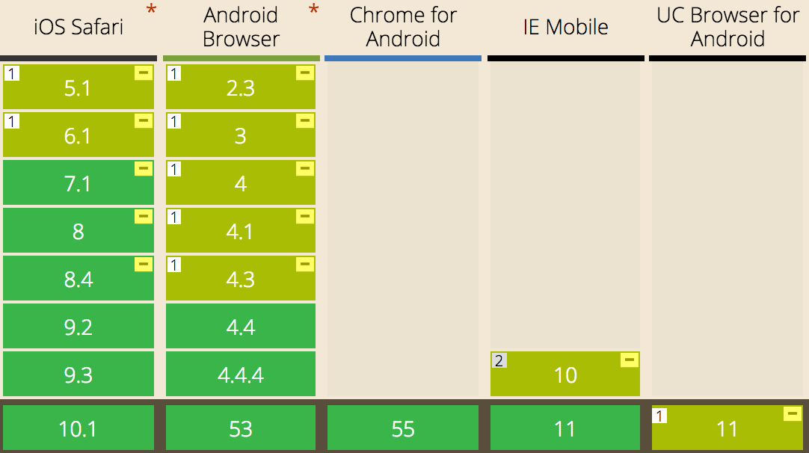
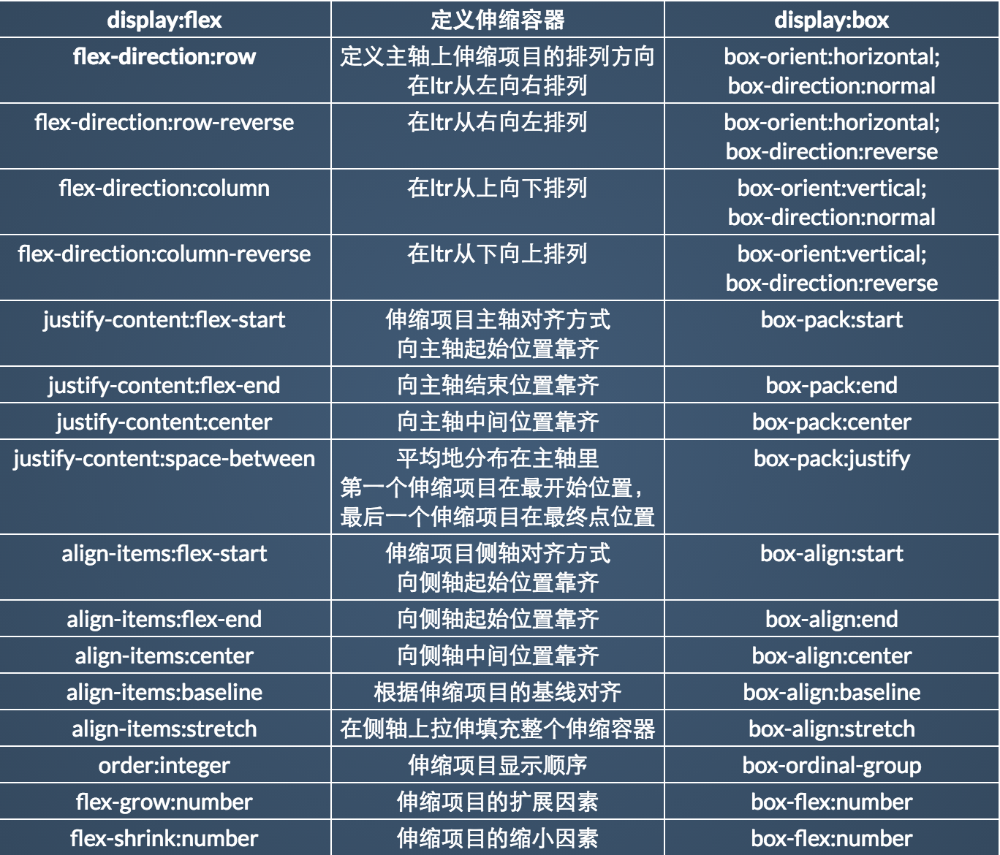

# Flexbox布局的正确使用姿势

## Flexbox兼容性

## Flexbox新旧属性

Flexbox的新属性提供了很多旧版本没有的功能，但是目前Android4.x和UC仍有一定市场占有率需要兼容，因此目前只使用新旧属性都有的功能。
能实现相同功能的Flexbox新旧属性如下表：

但想象是美好的，现实是残酷的，新旧属性里有那么几个顽固分子并不能乖乖的表现的一样，总有那么一点不同。
下面我们来看看是哪些新旧属性有不同：

#### `flex-direction:row-reverse` vs `box-orient:horizontal;box-direction:reverse`
相同点：改变主轴方向和伸缩项目的排列顺序；在ltr下伸缩项目从右到左排列。
不同点：
`flex-direction:row-reverse`：第一个伸缩项目向主轴起点对齐

`box-orient:horizontal;box-direction:reverse`：最后一个伸缩项目向主轴终点对齐

#### `flex-direction:column-reverse` vs `box-orient:vertical;box-direction:reverse`
相同点：改变主轴方向和伸缩项目的排列顺序；在ltr下伸缩项目从下到上排列。
不同点：
`flex-direction:column-reverse`：第一个伸缩项目向主轴起点对齐。

`box-orient:vertical;box-direction:reverse`：最后一个伸缩项目向主轴终点对齐。

#### `oreder:integer` vs `box-ordinal-group:integer`
相同点：定义伸缩项目显示顺序。
不同点：
`oreder:integer`：默认值为0；可以为负值。
`box-ordinal-group:integer`：默认值为1；取值大于1。

#### `flex-grow:number` vs `box-flex:number`
相同点：定义伸缩项目的扩展因素。
不同点：`box-flex:number`同时定义了伸缩项目的缩小因素。

#### `flex-shrink:number` vs `box-flex:number`
相同点：定义伸缩项目的缩小因素。
不同点：`box-flex:number`同时定义了伸缩项目的扩展因素。

## Flexbox分配空间原理

## Flexbox属性缩写陷阱

## 需要注意的Flexbox特性

## 旧版Flexbox的BUG